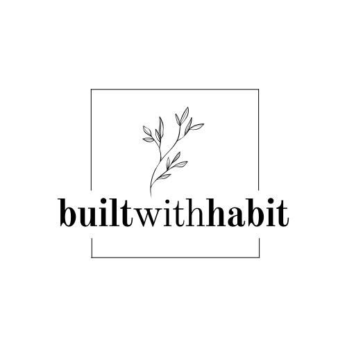

# Built with Habit

_A **beingsofhabit** venture_.



## Overview

This project is a booking portal for **builtwithhabit**, a platform that provides fitness and nutrition coaching. You can find the live site [here](https://build.beingsofhabit.com).

The platform aims to feature user authentication, a user and admin dashboards and a bookings page complete with payment integration.

_This project is currently under development._

## Tech Stack

- Bun
- SvelteKit
- TailwindCSS
- TypeScript
- Drizzle ORM
- Supabase
- Stripe
- AWS Lambda
- AWS SQS
- Vercel

## Development

Configure the environment variables:

```bash
# Edit the .env file with your own values
cp .env.example .env
```

Migrate the database:

```bash
bun run db:generate
bun run db:migrate

# Or, if one liners are your thing
bun run db:push
```

Install the dependencies:

```bash
bun install
```

Run the development server and listen on Stripe events:

```bash
bun run dev
bun run stripe:listen

# Or, if one liners are your thing
bun run start
```

Go to [http://localhost:5173](http://localhost:5173) to view the application.
